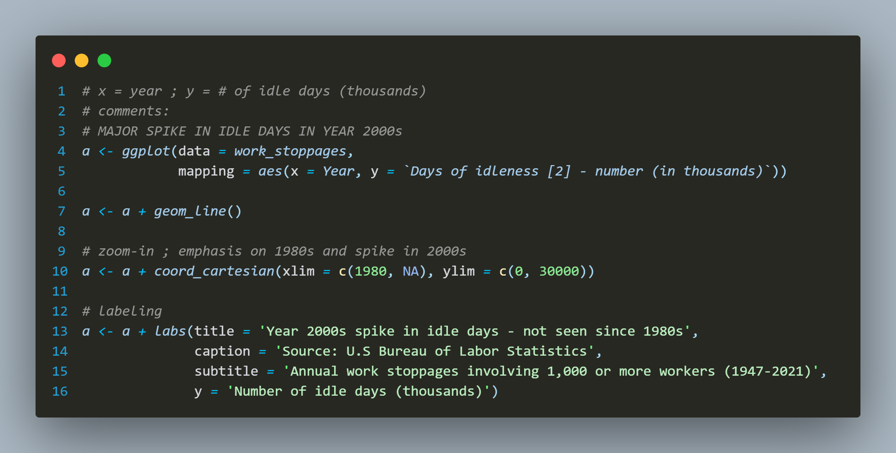
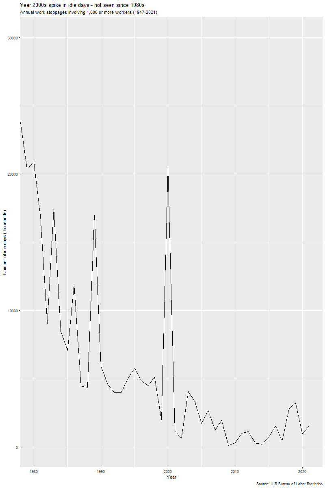
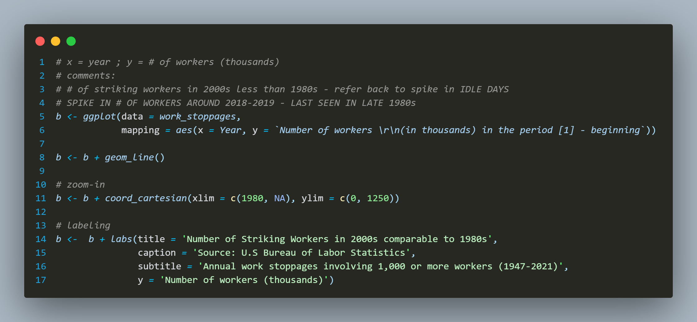
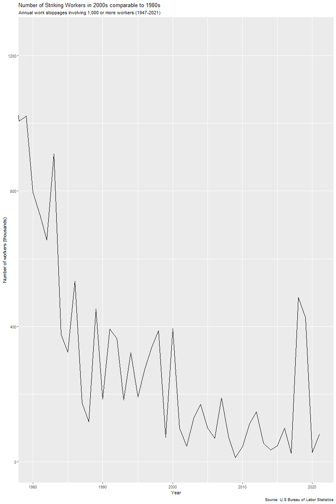

# Work stoppages dataset analysis

> *Last Updated*: 2023-10-19

***HELLO!***  
blah blah blah introduction stuff

## Introduction

### The Data

The primary *[dataset](<https://www.bls.gov/web/wkstp/monthly-listing.htm>)* worked with is sourced from the US Bureau of Labor Statistics. It provides a comprehensive record of major strikes and lockouts that have occurred since 1993. It offers valuable insights into labor movements, including details about the organizations involved, the industry and ownership type of the employers, start and end dates of the strikes, the number of workers participating, and the total worker-days idle.

### Project Focus

For the project, we will be concentrating on a portion of the data covering the years 1947-2021 in order to uncover some interesting insights and gain a deeper understanding of labour unions and their development over time.

3 focal points:  

1. **Severity of Strikes in the 2000s:** We will assess the severity of labor strikes during the 2000s, specifically by examining the "number of idle days." This metric will help us gauge the economic impact and the extent of disruption caused by strikes in this decade.

2. **Comparative Analysis: 1980s vs. 2000s:** To identify trends and changes in labor movements, we will compare the number of striking workers between the 1980s and the 2000s. This analysis will reveal whether there were notable shifts in the scale of strikes over these two decades.

3. **Severity Comparison with 2018-2019:** While our dataset primarily focuses on the 2000s, we will also draw attention to the severity of strikes in this period compared to the strikes that occurred in 2018-2019. We will consider both the "number of idle days" and the "number of striking workers" to emphasize any differences in the impact of these labor actions.

## Data preparation

Given the limited scope of things, I decided to keep things simple with the naming conventions for the prepared graphs. Additionally, the required data columns (year, idle days, and number of workers) were all sourced from the primary *[dataset](<https://www.bls.gov/web/wkstp/monthly-listing.htm>)* and placed into my own comprehensive *[dataset](data-analysis/annual-listing.xlsx)*.

### Graph 1: Idle days

>Below is the steps taken in preparing the idle days graph:
>>
>
>It results in the following graphic:
>>

### Graph 2: Number of Workers

>Below is the steps taken in preparing the idle days graph:
>>
>
>It results in the following graphic:
>>

## Presentation of insights and conclusion

**NOTE:** *Due to this being a revamping of an old project of mine I sadly do not have access to the original graphs used in the presentation (I delete old files and I also reset my PC). I may fix this in a later update.*

>below is the presentation... i may or may not need to change it to a YT video instead...
>>